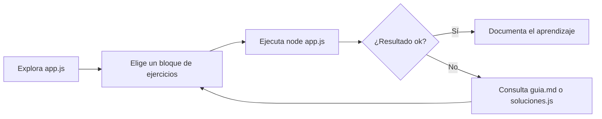

<div align="center">

# Arrays Practice Lab

**Aprende a dominar las transformaciones funcionales en JavaScript con un setup limpio, moderno y listo para Node.js.**


</div>

> [!IMPORTANT]
> El archivo protagonista es `app.js`. Ahí encontrarás los enunciados y huecos (`TODO`) para tus soluciones con **map**, **filter**, **reduce**, recorridos con **forEach/for...in** y todo un bloque de arrays (creación, manipulación y estructuras avanzadas).

## 🧭 Visión general

| Archivo | Rol | Detalle |
| --- | --- | --- |
| `app.js` | Zona de práctica | Contiene el array base `alumnos` y más de 20 retos progresivos: map/filter/reduce, combinaciones, forEach/for...in y arrays avanzados. |
| `SOLUCIONES/soluciones.js` | Referencia rápida | Implementaciones completas para validar tu enfoque. |
| `SOLUCIONES/guia.md` | Guía pedagógica | Explica qué hace cada ejercicio y el tipo de dato que devuelve. |

## 🧱 Bloques de práctica

- **Transformaciones funcionales**: 3 ejercicios de map, 3 de filter, 3 de reduce y 3 combinados.
- **Recorridos clásicos**: 3 retos con `forEach` y 3 con `for...in` para manipular arrays y objetos.
- **Arrays en profundidad**: creación de arrays, inserciones/borrados, propiedades y métodos clave.
- **Estructuras avanzadas**: ejercicios con arrays paralelos y multidimensionales para modelar datos reales.
- **Dataset ampliado**: además de `alumnos`, ahora tienes inventario, horarios, grupos y más colecciones listas para usar.

## 🚀 Paso 1 · Instalar Node.js (Windows)

> [!TIP]
> Recomendado: la versión LTS (actualmente 22.x). Incluye npm y soporte a largo plazo.

### Opción A · Instalador oficial
1. Visita [nodejs.org](https://nodejs.org) y descarga **Windows Installer (LTS)**.
2. Ejecuta el `.msi` y acepta las opciones por defecto (incluye npm).
3. Al terminar, abre PowerShell y verifica:
   ```powershell
   node -v
   npm -v
   ```

### Opción B · nvm-windows (gestor de versiones)
1. Descarga el instalador desde [nvm-windows](https://github.com/coreybutler/nvm-windows/releases).
2. Instala nvm y abre una nueva ventana de PowerShell.
3. Instala y usa la versión LTS estable:
   ```powershell
   nvm install 22.0.0
   nvm use 22.0.0
   node -v
   ```

## 📥 Paso 2 · Obtener el repositorio

```powershell
cd c:\ruta\donde\trabajas
git clone https://github.com/DavidGom1/ReduceMapFilter-Practice.git
cd ReduceMapFilter-Practice
```

Si ya lo tienes descargado (por ejemplo, desde un ZIP), basta con abrir la carpeta en VS Code.

## ▶️ Paso 3 · Ejecutar `app.js`

```powershell
node app.js
```

> [!NOTE]
> El script mostrará `null` hasta que reemplaces los `TODO` por tus soluciones. ¡Perfecto para ir validando cada bloque!

## 🧪 Cómo practicar cada bloque

1. **Resuelve** cada ejercicio en `app.js` donde pone `let ... = null;`.
2. **Ejecuta** `node app.js` para ver tus resultados en consola.
3. **Compara** con `SOLUCIONES/soluciones.js` si necesitas una pista o validación final.
4. **Itera** usando herramientas modernas:
   - Instala `nodemon` (opcional) para recargar automáticamente:
     ```powershell
     npm install -g nodemon
     nodemon app.js
     ```
   - Añade `console.table()` cuando quieras inspeccionar arrays u objetos.

## 🌀 Flujo recomendado



## 💡 Sugerencias de estilo moderno

- Usa **destructuring** para que tus callbacks sean más legibles.
- Encadena métodos (`alumnos.filter(...).map(...).reduce(...)`) para ejercicios combo.
- Aprovecha **template strings** para crear salidas bonitas como `"María (DAW1) - Nota: 8.20"`.

## ✅ Checklist rápida

- [ ] Node.js instalado y verificado (`node -v`).
- [ ] Repositorio descargado/abierto en VS Code.
- [ ] `app.js` ejecutándose con `node app.js`.
- [ ] Primer bloque de ejercicios completado.
- [ ] Opcional: `nodemon` instalado para recarga automática.

---

<div align="center">
  <sub>¡Comparte tus mejoras o envía un PR si automatizas pruebas nuevas!</sub>
</div>
